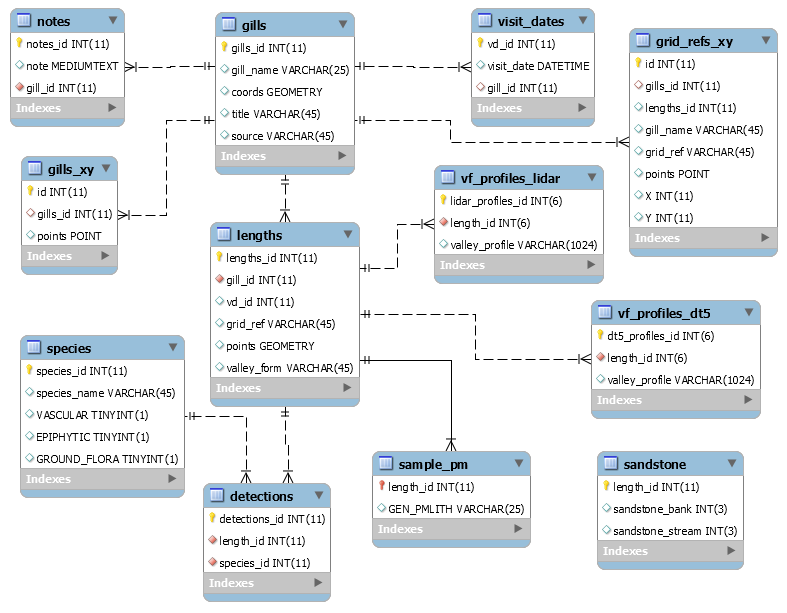

## The gills database.

<center>

</center>
Figure 2. Gills database schematic.

## Database access.

### Access from R.
The database can be accessed from R or other programming language. You can use a simple query, e.g. to get the list of all the plants encountered in the project:


```r
library("RMySQL")
mydb <- dbConnect(MySQL(), 
                   user  = "guest",
                   password    = "guest",
                   dbname="gills",
                   port = 3306,
                   host   = "sxouse.ddns.net")
rs1 = dbSendQuery(mydb, "select * from species;")
data <- fetch(rs1, n=10)  # Just the first 10 rows
dbDisconnect(mydb)
```

```
## [1] TRUE
```

```r
print(data)
```

```
##    species_id            species_name VASCULAR EPIPHYTIC GROUND_FLORA
## 1           1     Adoxa_moschatellina        1         0            1
## 2           2         Alnus_glutinosa        1         0            0
## 3           3        Anemone_nemorosa        1         0            1
## 4           4     Angelica_sylvestris        1         0            1
## 5           5          Arum_maculatum        1         0            1
## 6           6    Athyrium_filixfemina        1         0            1
## 7           7      Atrichum_undulatum        0         0            1
## 8           8               Betula_sp        1         0            0
## 9           9        Blechnum_spicant        1         0            1
## 10         10 Brachythecium_rutabulum        0         0            1
```
Or more complicated joins, for example to list plants found in a particular gill


```r
library("RMySQL")
q <- "select distinct species.species_name from gills
	  join lengths on lengths.gill_id = gills.gills_id
    join detections on detections.length_id = lengths.lengths_id
    join species on species.species_id = detections.species_id
    where gill_name = 'Costells';"

mydb <- dbConnect(MySQL(), 
                   user  = "guest",
                   password    = "guest",
                   dbname="gills",
                   port = 3306,
                   host   = "sxouse.ddns.net")
rs1 = dbSendQuery(mydb, q)
data <- fetch(rs1, n=10) # Just fetch the top 10 species for illustration
dbDisconnect(mydb)
```

```
## Warning: Closing open result sets
```

```
## [1] TRUE
```

```r
print(data)
```

```
##               species_name
## 1            Ajuga_reptans
## 2          Alnus_glutinosa
## 3         Anemone_nemorosa
## 4     Athyrium_filixfemina
## 5       Atrichum_undulatum
## 6                Betula_sp
## 7         Blechnum_spicant
## 8       Cardamine_flexuosa
## 9            Carex_pendula
## 10 Chiloscyphus_polyanthos
```
### Access from spreadsheet.
Single tables can be imported into Excel using the MySQL for Excel add-in, use the information shown in the code snippets to create a connection.

### Access from Shiny App: 
No Shiny Apps for gills yet.

## Tables.

### Detections.
The Detections table records all the entries that the surveyors made on the recording sheets. Each entry in the Detections table shows that a particular species(identified by species_id) was present in a particular stream length (length_id). Every detection has a unique detection_id.

### Species.
The species table is a list of all the plant species found during the course of the project.  Species names are given in full (genus and species) without abbreviation, and with an underscore between the generic and the specific name, for ease of digital import.

### Lengths.
The sampling units for the project are 30m lengths of stream, extending approximately 10m to each side. lengths belong to gills, identified by an gill_id which points to the gill to which the length belongs. Every length has a unique length_id that can be used to find the records belonging to it, that is, the plants found in that length. 

### Gills (table).

## How the downloads could be used: examples.
No examples yet

## Please acknowlege us.
The material on these pages and the data available to user "guest" are covered by the [GNU General Public License](LICENSE.txt). If you use our data in your teaching or research, please acknowlege that by citing the River Ouse Project, University of Sussex, and referring to our website, [www.sussex.ac.uk/riverouse/](http://www.sussex.ac.uk/riverouse/).

Thank you.
John Pilkington
<j.b.pilkington@gmail.com>
