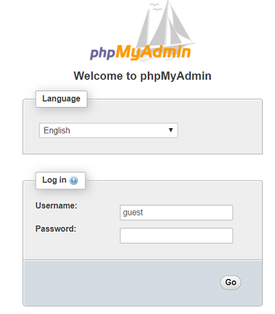

## The River Ouse Project.

The River Ouse Project was started by Dr Margaret Pilkington and colleagues in the Centre for Continuing Education, University of Sussex. Margaret is now retired with emeritus status and continues to run the project with a team of volunteers, in association with the University of Sussex.

The team does botanical surveys of streamside grassland and steep wooded valleys (gills) in the upper reaches of the Sussex Ouse, a short flashy river arising on the southern slopes of the Ashdown Forest, part of the High Weald AONB. Survey sites are chosen on the basis of species richness, potential for restoration and contribution to flood control, and surveyed using the sampling methods outlined in Rodwell, J S (1992. British Plant Communities, Volume 3, Grasslands and Montane Communities). Survey data are transferred from the paper record taken in the field to Excel spreadsheets, and from there after validation and cleaning into two MySQL (MariaDB) databases, meadows and gills.

The objective of this project is to make the databases publicly available, and to develop resources to make commonly needed derived quantities such as species frequencies readily accessible.

## The meadows database.

<center>

</center>
Figure 1. Meadows database schematic.

In this diagram, the tables joined by constraint links represent the core of the meadows database. The two stand-alone tables do not contain survey data but may be used as ancillary reference (they contain data from the NVC tables). Access to the survey data is by SQL query into the constraint-linked tables. 

## Database access.

Guest access to the database can be obtained here:
<http://sxouse.ddns.net:82/phpmyadmin/>

Log in as "guest" with password "guest".


Select the meadows database. Data may be retrieved using simple SQL searches:


```r
library("RMySQL")
```

```
## Loading required package: DBI
```

```r
mydb = dbConnect(MySQL(), user='guest', password = 'guest', dbname='meadows', port = 3306, host='sxouse.ddns.net')
rs1 = dbSendQuery(mydb, "select assembly_name, nvc from assemblies where nvc is not null;")
data <- fetch(rs1, n=10)
dbDisconnect(mydb)
```

```
## Warning: Closing open result sets
```

```
## [1] TRUE
```

```r
print(data)
```

```
##          assembly_name  nvc
## 1             Baybrook MG5a
## 2    Little_field_east MG6b
## 3             Clayland MG5a
## 4         Horse_brooks MG6a
## 5    Chilly_wood_brook MG7d
## 6            Four_acre MG5a
## 7             Inafield MG5a
## 8         Middle_field MG5a
## 9  Lower_eastlands_dry MG5c
## 10 Lower_eastlands_wet  M23
```

Or more complicated joins:


```r
library("RMySQL")
q <- "select assembly_name, nvc, count(species.species_id)
from assemblies
join quadrats on quadrats.assembly_id = assemblies_id
join records on records.quadrat_id = quadrats_id
join species on species.species_id = records.species_id
where nvc in ('MG5a', 'MG5c', 'MG6a', 'MG6b')
and species.species_name = 'Lolium_perenne'
group by assemblies_id, species_name;" 

mydb = dbConnect(MySQL(), user='guest', password = 'guest', dbname='meadows', port = 3306, host='sxouse.ddns.net')
rs1 = dbSendQuery(mydb, q)
data <- fetch(rs1, n=10)
dbDisconnect(mydb)
```

```
## Warning: Closing open result sets
```

```
## [1] TRUE
```

```r
print(data)
```

```
##          assembly_name  nvc count(species.species_id)
## 1             Baybrook MG5a                         2
## 2    Little_field_east MG6b                         1
## 3             Clayland MG5a                         1
## 4         Horse_brooks MG6a                         5
## 5            Four_acre MG5a                         2
## 6             Inafield MG5a                         9
## 7         Middle_field MG5a                         8
## 8  Lower_eastlands_dry MG5c                         3
## 9        Spring_meadow MG6b                         6
## 10        Cross_meadow MG6b                         4
```

If working in phpMyAdmin as described above, you would just enter the query at the command line.
