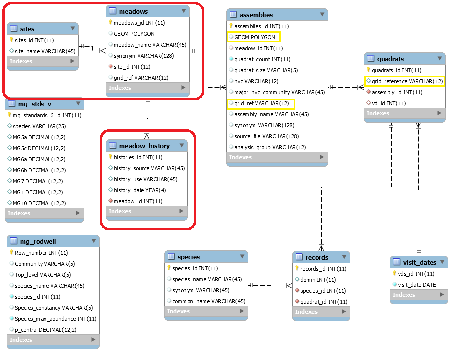
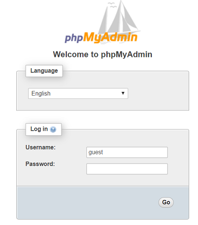

```{r setup, include=FALSE}
knitr::opts_chunk$set(echo = TRUE)
```

## The River Ouse Project.

The River Ouse Project was started by Dr Margaret Pilkington and colleagues in the Centre for Continuing Education, University of Sussex. Margaret is now retired with emeritus status and continues to run the project with a team of volunteers, in association with the University of Sussex.

The team does botanical surveys of streamside grassland and steep wooded valleys (gills) in the upper reaches of the Sussex Ouse, a short flashy river arising on the southern slopes of the Ashdown Forest, part of the High Weald AONB. Survey sites are chosen on the basis of species richness, potential for restoration and contribution to flood control, and surveyed using the sampling methods outlined in Rodwell, J S (1992. British Plant Communities, Volume 3, Grasslands and Montane Communities). Survey data are transferred from the paper record taken in the field to Excel spreadsheets, and from there after validation and cleaning into two MySQL (MariaDB) databases, meadows and gills.

The objective of this project is to make the databases publicly available, and to develop resources to make commonly needed derived quantities such as species frequencies readily accessible.

## The meadows database.

<center>

</center>
Figure 1. Meadows database schematic.

In this diagram, the tables joined by constraint links contain the survey data. The two stand-alone tables contain data from the NVC standards and may be used as ancillary reference. 

## Database access.

Public users may log into the database with user name "guest", using password "guest". Guest users can access all the tables except those outlined in red in the diagram. The fields outlined in yellow are not publicly available.

Guest access to the database can be obtained here:
<http://sxouse.ddns.net:82/phpmyadmin/>

Log in as "guest" with password "guest".


Select the meadows database. Data may be retrieved using SQL searches.

The database can also be accessed from R or other programming language. You can use a simple query:

```{r}
library("RMySQL")
mydb = dbConnect(MySQL(), user='guest', password = 'guest', dbname='meadows', port = 3306, host='sxouse.ddns.net')
rs1 = dbSendQuery(mydb, "select assembly_name, nvc from assemblies where nvc is not null;")
data <- fetch(rs1, n=10)
dbDisconnect(mydb)
print(data)
```

Or more complicated joins:

```{r}
library("RMySQL")
q <- "select assembly_name, nvc, count(species.species_id)
from assemblies
join quadrats on quadrats.assembly_id = assemblies_id
join records on records.quadrat_id = quadrats_id
join species on species.species_id = records.species_id
where nvc in ('MG5a', 'MG5c', 'MG6a', 'MG6b')
and species.species_name = 'Lolium_perenne'
group by assemblies_id, species_name;" 

mydb = dbConnect(MySQL(), user='guest', password = 'guest', dbname='meadows', port = 3306, host='sxouse.ddns.net')
rs1 = dbSendQuery(mydb, q)
data <- fetch(rs1, n=10)
dbDisconnect(mydb)
print(data)
```

Single tables can be imported into Excel using the MySQL for Excel add-in, use the information shown in the code snippets to create a connection.

## Tables.

### records.

The records table records all the entries that the surveyors made on the recording sheets.
