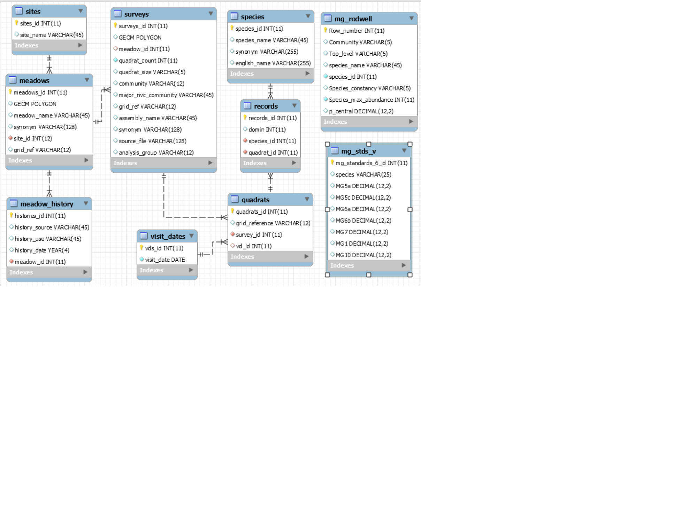

## The River Ouse Project.

The [River Ouse Project](http://www.sussex.ac.uk/riverouse/) was started by Dr Margaret Pilkington and colleagues in the Centre for Continuing Education, University of Sussex. Margaret is now retired with emeritus status and continues to run the project with a team of volunteers, in association with the University of Sussex.
<center>


Figure 1, Survey sites. Green points: meadows, brown points: gills.

</center>
The team does botanical surveys of streamside grassland and steep wooded valleys (gills) in the upper reaches of the Sussex Ouse, a short flashy river arising on the southern slopes of the High Weald AONB (Area of Outstanding Natural Beauty). Survey sites are chosen on the basis of species richness, potential for restoration and contribution to flood control, and surveyed using the sampling methods outlined in Rodwell, J S (1992. British Plant Communities, Volume 3, Grasslands and Montane Communities). Survey data are transferred from the paper record taken in the field to Excel spreadsheets, and from there after validation and cleaning into two MySQL (MariaDB) databases, meadows and gills.

My objective here is to make the databases publicly available, and to develop resources to make commonly needed derived quantities such as species frequencies readily accessible.

## The meadows database.

<center>

</center>
Figure 2. Meadows database schematic. The tables joined by constraint links contain the survey data. The two stand-alone tables contain data from the NVC standards and may be used as ancillary reference. 

## Database access.

### phpMyAdmin.
Public users may log into the database with user name "guest", using password "guest".

Guest access to the database can be obtained here:
<http://sxouse.ddns.net:82/phpmyadmin/>

Log in as "guest" with password "guest".


Select the meadows database. Data may be retrieved using SQL searches.

### Access from R.
The database can also be accessed from R or other programming language. You can use a simple query:


```r
library("RMySQL")
mydb = dbConnect(MySQL(), user='guest', password = 'guest', dbname='meadows', port = 3306, host='sxouse.ddns.net')
rs1 = dbSendQuery(mydb, "select assembly_name, community from assemblies where community is not null;")
data <- fetch(rs1, n=10)
dbDisconnect(mydb)
```

```
## [1] TRUE
```

```r
print(data)
```

```
##          assembly_name community
## 1             Baybrook      MG5a
## 2    Little_field_east      MG6b
## 3             Clayland      MG5a
## 4         Horse_brooks      MG6a
## 5    Chilly_wood_brook      MG7d
## 6            Four_acre      MG5a
## 7             Inafield      MG5a
## 8         Middle_field      MG5a
## 9  Lower_eastlands_dry      MG5c
## 10 Lower_eastlands_wet       M23
```

Or more complicated joins:


```r
library("RMySQL")
q <- "select assembly_name, community, count(distinct(species.species_id))
from assemblies
join quadrats on quadrats.assembly_id = assemblies_id
join records on records.quadrat_id = quadrats_id
join species on species.species_id = records.species_id
where community in ('MG5a', 'MG5c', 'MG6a', 'MG6b')
# and species.species_name = 'Lolium_perenne'
group by assemblies_id;" 

mydb = dbConnect(MySQL(), user='guest', password = 'guest', dbname='meadows', port = 3306, host='sxouse.ddns.net')
rs1 = dbSendQuery(mydb, q)
data <- fetch(rs1, n=10)
dbDisconnect(mydb)
```

```
## Warning: Closing open result sets
```

```
## [1] TRUE
```

```r
print(data)
```

```
##          assembly_name community count(distinct(species.species_id))
## 1             Baybrook      MG5a                                  37
## 2    Little_field_east      MG6b                                  29
## 3             Clayland      MG5a                                  34
## 4         Horse_brooks      MG6a                                  27
## 5            Four_acre      MG5a                                  31
## 6             Inafield      MG5a                                  32
## 7         Middle_field      MG5a                                  37
## 8  Lower_eastlands_dry      MG5c                                  43
## 9        Spring_meadow      MG6b                                  31
## 10        Cross_meadow      MG6b                                  32
```
### Access from spreadsheet.
Single tables can be imported into Excel using the MySQL for Excel add-in, use the information shown in the code snippets to create a connection.

### Access from Shiny App.
The on-line app calculates species frequencies and counts by community or assembly. It's under development, more functionality to be added.
[Click here to run it]( https://sussexouse.shinyapps.io/River-Ouse-Project-databases/)

## Tables.

### Records.
The records table records all the entries that the surveyors made on the recording sheets. Essentially, it records that a particular species(identified by species_id) was present in a particular quadrat (quadrat_id) with a particular domin value (abundance). Every record has a unique record_id.

### Species.
The species table is a list of all the plant species found during the course of the project. The species names are those used in the NVC tables. We retain them in this long-running project for the sake of continuity and compatibility with reports completed earlier. The synonym field contains the more recent names (Stace), and formal common names are included in the english-names field. Species names are given in full (genus and species) without abbreviation, and with an underscore between the generic and the specific name, for ease of digital import. There is one anomalous species name, "Agrostis_capillaris_stolonifera". A. capillaris and A. stolonifera are readily distinguished when flowers are available, but can be indistinguishable on vegetative characteristics. Surveys often take place out of the flowering season so for the time being we treat all the records as unreliable (and tend to exclude A. capillaris_stolonifera from our analyses). This policy may be reviewed in future.

You can find which species is recorded in a particular record (e.g. 229) with something like: 

SELECT species_name FROM species JOIN records ON records.species_id = species.species_id WHERE records_id = 229;

If you wanted to.

### Quadrats.
The sampling unit for the project is a quadrat. Quadrats belong to assemblies (see next paragraph for a definition), identified by an assembly_id which points to the assembly to which the quadrat belongs. Every quadrat has a unique quadrat_id that can be used to find the records belonging to it, that is, the plants found in that quadrat. 

You could find which plant species were found in a particular quadrat (e.g. 1751) with something like:

SELECT DISTINCT (species_name) FROM species 
  JOIN records ON records.species_id = species.species_id
  JOIN quadrats ON records.quadrat_id = quadrats.quadrats_id
WHERE quadrats_id = 1751;

### Assemblies.
Assemblies are the vegetative units that we sample. Sites and meadows (not available to "guest") record the location of our samples, but often it is found that one meadow may have several recognisable vegetative units in it. The constraint link between the sites and meadows tables in Figure 1 show this one-to-many relationship. Quadrats need to know which assembly they belong to, so the quadrats table entries each have an assembly_id which can be used to join the assemblies and quadrats tables on assemblies_id = assembly_id. Note the naming convention here, which we adhere to throughout: Parent items (assemblies) have a (plural) assemblies_id; child items (quadrats) have a (singular) assembly_id because each belongs to just one assembly.

The assemblies table also records the quadrat count for the assembly, and the size of quadrat used to sample it. We use either 2mx2m or 4mx4m quadrats.

For each assembly, the team assign an NVC class by matching the NVC standards using MATCH software together with an understanding of general grassland ecology. The assessed NVC class is listed in the community column, and the top-level NVC community is in major_nvc_community.

### mg_rodwell.
This table contains mesotrophic grassland species frequencies listed in British Plant Communities vol 3, Grasslands and Montane Communities.

### mg_stds_v.
For some analyses (specifically, the 2019 BES poster) we used a set of 22 species selected because each occurred with a frequency of V (0.8 - 1.0, mid-range 0.8) in at least one of the mesotrophic grassland standards of interest. The mg_stds_v table lists them.

## How the downloads could be used: examples.
Some examples with R code available [here](Notebook.nb.html) and here:[Stellaria_etc](stellaria_etc.nb.html).
<<<<<<< HEAD
Some recent playing around with graphs and odds ratios, with possible evidence for short range associations between plants, [here](https://zygodon.github.io/graphs/igraph_notebook3.nb.html)
=======
Some recent playing around with graphs and odds ratios, with possible evidence for short range associations between plants, [here](igraph_notebook3.nb.html)
>>>>>>> 7379f159098fe5bb8b9bd63b2c2f9d9edd0c964d

## Please acknowlege us.
The material on these pages and the data available to user "guest" are covered by the [GNU General Public License](LICENSE.txt). If you use our data in your teaching or research, please acknowlege that by citing the River Ouse Project, University of Sussex, and referring to our website, [www.sussex.ac.uk/riverouse/](http://www.sussex.ac.uk/riverouse/).

Thank you.
John Pilkington
<j.b.pilkington@gmail.com>

